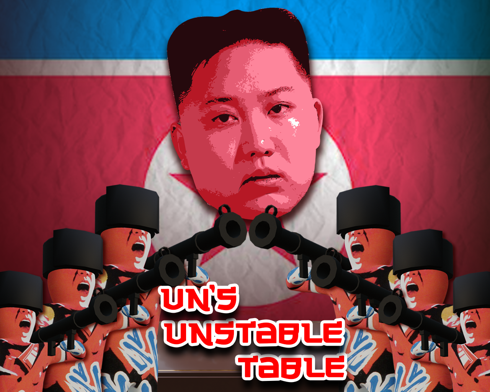
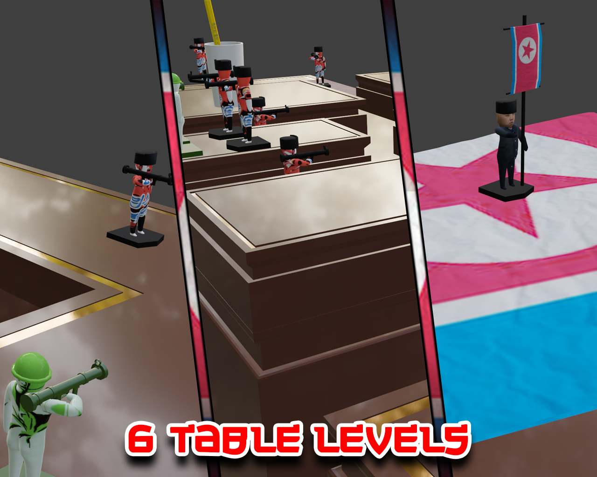

"*North, East,*

*South, West,*

*Give me another*

*nuke to test.*"

---
---

**LD49 page:** https://ldjam.com/events/ludum-dare/49/uns-unstable-table

**Play in the browser:** https://leefu.itch.io/uns-unstable-table

---
---

What's more unstable than Kim Jong Un himself? Kim Jong Un's unstable table!

Fight your way through North Korea in an intense physics based, tactical, tabletop battle. Lead your rebel soldiers to victory by overthrowing the dictator that is Kim Jong Un and bring peace and prosperity to the world.

Using your skill and dexterity with the Push Stick, maneuver rebel soldiers into strategic positions over the tabletop terrain. When all looks well, launch an attack and bring down the other sides flag bearing General. But be careful... two can play at this game and unfortunately for you, Kim is feeling a bit... UNSTABLE!!!

Can you stop Kim or will he get the best of you? Battle your way through 6 treacherous tables and find out!

**CONTROLS:**

**Mouse-** Move Push Stick

**Left Mouse Button-** Raise/Lower Push Stick

**Hold Right Mouse Button-** Rotate Push Stick

---
---

**Post-deadline bug fix (+00:46):** Level 5 breaking collider position corrected.  
